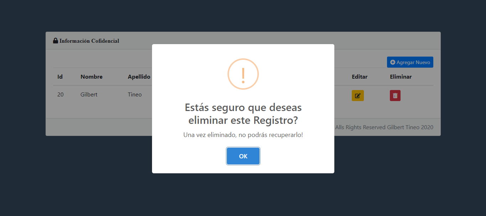

# CRUD

En este proyecto se pueden realizar acciones como
Crear, Leer, Actualizar y Eliminar información que está alojada en una Base de Datos.
Con el objetivo de poder manejar la información de una Base de Datos pero de una manera más Dinámica.

## Lenguajes y Tecnologías Utilizadas

- HTML

- CSS

- PHP

- JavaScript

- BootsTrap

- Sweet Alert2

